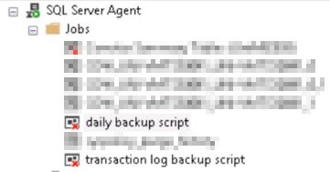
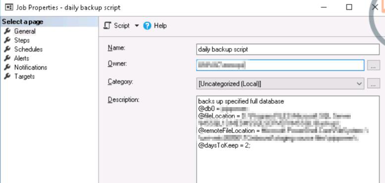
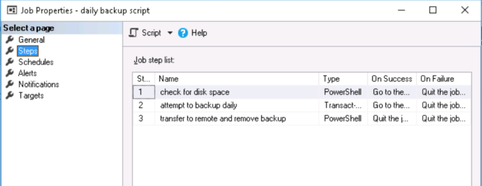

# SQL backup to remote pc

Checks a file location for disk space before creating a .bak backup. Subsequently proceed to check remote pc file storage space before sending .bak over. This is an extension to the [Reference](https://solutioncenter.apexsql.com/how-to-create-and-manage-database-backup-chains-in-sql-server/) link mentioned with the extension of transfering the backup and checking for folder/file space, edit as accordingly.

## Table of Contents

- [SQL backup to remote pc](#sql-backup-to-remote-pc)
  - [Table of Contents](#table-of-contents)
  - [How to use](#how-to-use)
  - [Permissions](#permissions)
  - [Webhooks](#webhooks)
  - [File Size](#file-size)
  - [Reference](#reference)

---

## How to use

```bash
git clone https://github.com/jnre/SQL_backupremote.git
```

Restore the 2 jobs:

1. open SQL Server Management Studio
2. On the File menu, open the file containing the scripted job
3. Execute the script to create the job

There would be 2 jobs that needs to be created in Microsoft SQL server under SQL server Agent, a full transaction backup that happens everyday at 12am(daily backup script) and a transaction backup that happens every 2 hour(transaction log backup script). the file transfered over will be removed depending on the days to Keep parameter

 

Under Job properties General, specifed parameters in the description are used, edit the parameters for your use , namely:

- @db0, the database targeted
- @fileLocation, where local database will be first created
- @remoteFileLocation, another server filelocation which you wish to store the database
- @daysToKeep,[only for dailybackup], no of days to keep for both transac and full backup on remote.

**Important** to keep `;` at the back of each parameters, edit them for your own use



3 steps would be created in the job:

- Check for disk space, powershell script
- Create local copy of database, transact-SQL script
- copy to remote pc, powershell script (delete local copy only in daily full backup script)

  

DO note that deleting the local copy is scheduled in the daily backup script job for BOTH transaction and full logs.

## Permissions

Create a Credentials in SQL server > Security > Credentials called 'backupRemote' with your user account and password.

Create a Proxy in SQL server > SQL Server Agent > PowerShell with the 'backupremote' credential, this is so it allows you to access the remote pc to check its file space, may not be required depending on your server permissions

## Webhooks

webhooks were created to notify user which has been edited. current channel wont work.

## File Size

file size are subjected to your disgresstion, current limit is 20 MB, changes can be made in powershell script

## Reference

<https://solutioncenter.apexsql.com/how-to-create-and-manage-database-backup-chains-in-sql-server/>

<https://www.sqlshack.com/understanding-log-sequence-numbers-for-sql-server-transaction-log-backups-and-full-backups/>
